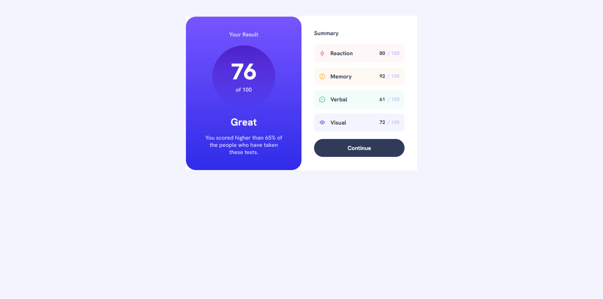

# Frontend Mentor - Results summary component solution

This is a solution to the [Results summary component challenge on Frontend Mentor](https://www.frontendmentor.io/challenges/results-summary-component-CE_K6s0maV). Frontend Mentor challenges help you improve your coding skills by building realistic projects.

## Table of contents

- [Overview](#overview)
  - [The challenge](#the-challenge)
  - [Screenshot](#screenshot)
  - [Links](#links)
- [My process](#my-process)
  - [Built with](#built-with)
  - [What I learned](#what-i-learned)
  - [Continued development](#continued-development)
  - [AI Collaboration](#ai-collaboration)
- [Author](#author)

## Overview

### The challenge

Users should be able to:

- View the optimal layout for the interface depending on their device's screen size
- See hover and focus states for all interactive elements on the page
- **Bonus**: Use the local JSON data to dynamically populate the content

### Screenshot

### Links

- Solution URL: [GitHub](https://github.com/ruslan898/frontend-mentor_results-summary-component-main)
- Live Site URL: [Netlify](https://chipper-eclair-81b876.netlify.app/)

## My process

### Built with

- Sass variables
- Flexbox
- Mobile-first workflow
- [React](https://reactjs.org/) - JS library

### What I learned

While working through this project, I've practised creating custom reusable components

### Continued development

I want to continue practising creating custom components and refining the structure of my React apps in future projects

### AI Collaboration

I've used GitHub Copilot for debugging my app and it helped me to correct my mistakes

## Author

- GitHub - [ruslan898](https://github.com/ruslan898)
- Frontend Mentor - [@ruslan898](https://www.frontendmentor.io/profile/ruslan898)

